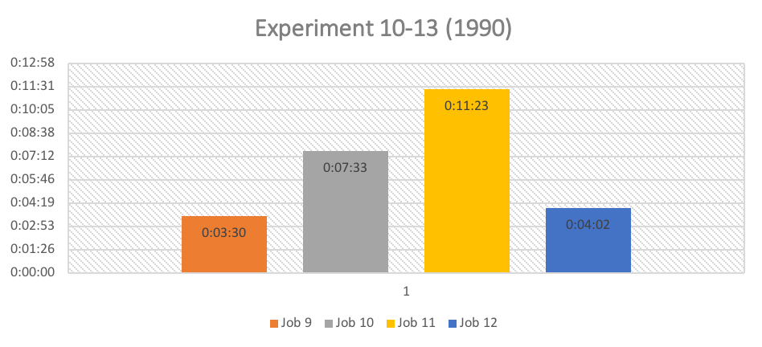
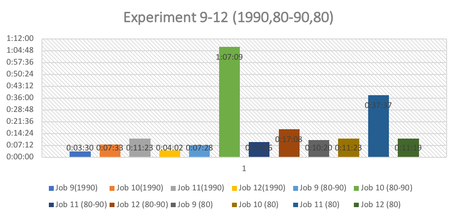

# Big-Data-Analysis

With the default setting that is the combiner OFF and the compressor also OFF, we observed that there was not a significant difference of in the execution time of the files. Although I observed some difference in execution time, but that may be just because of the average time of Maps and reduce time. Job 3 took the highest time to complete as out of 4 allocated Reducer I got killed and also 1 of the Mapper was also killed.

# 

With these files, I changed the setting and switched on the Snappy compressor while keeping the combiner off. So, the compressor might have worked and compressed at high speed and given reasonable compressions but during the execution the reducers were killed and also the network connection might have affected the execution time.

# 

In this I changed the setting making the compressor on and the combiner on. I observed that there was increase in the time of execution and suddenly there was a drop. The initial increase was due to the failure of the reducers and the Job 12 took comparatively less time as there was no killing of the reducers. The average shuffle time and the sort time was lesser than the previous set which has executed only with snappy compressor on.

# 

In this the compressor was changed to Gzip, and combiner was not brought into action. With this I saw a drastic change in the execution time if compared to the previous set of files with compressed by the Snappy compressor. Only one of the files of job 13 had higher time then the others and the other in the same group. It has no significant difference in the avg shuffle and the ang sort time. On further investigation the thing that could have been affected the execution time would have been the network issue, or unavailability of the container, or loading of the datanode.

# 

These files were executed with using Gzip compressor to compress and the combiner function to compact the size. Although both the combiner and compressor function were on for these files, the execution time was higher than the execution time of the files in the previous group which did not had combiner on. This was an abnormal behavior because as per the combiner function the execution time should have decreased. With deeper analysis we found that reducers and mapper killing might have caused the execution time to increase.

# 

This is the largest file in the given dataset. From the graph we can see that there was some decrease with increase in the number of the reducers in the Job 2. But later as more reducers were added the execution increased a bit as compared. However, the increase was not that significant. And also, with further analysis we found that the there was no effect on the avg shuffle and merge time. So, we conclude that increase in the number of the reducer didn’t help in reducing the execution time.

# 

With these files, I changed the setting and switched on the Snappy compressor while keeping the combiner off. So, the compressor might have worked and compressed at high speed and given reasonable compressions but during the execution the reducers were killed and also the network connection might have affected the execution time.

# 

In this along with the Snappy compressor, the combiner was also brought in. In due to this combiner switching on we saw a drastic change in the execution time if compared to both when the files were ran without the Snappy compressor and with only Snappy compressor. Only the job 10 showed some abnormality with high execution time. But with deeper analysis we got to know that the job 10 showed lower avg shuffle time and merge time as compared to the previous groups.

# 

With these set of files, we only brought in the Gzip compressor, no combiner was brought. But with this compressor we found that it didn’t worked well as compared to the Snappy compressor, except the Job 16. All the jobs in this group showed higher execution time than with Snappy compressor. Also, the average shuffle time and avg merge time is more than the one with snappy.

# 

In this group of files both the Gzip compressor and the combiner were brought in to picture. If comparing with the previous group which had only Gzip compressor on, the execution time is lower in this case. So, the combiner worked in normal way. But if we compare it with the files having Snappy compressor and combiner on, than the avg shuffle time and the avg merge time was almost similar. So, we can conclude that both compressor have almost same effect on the files.

# 

This is the second largest file in size. We the above graph we can observe that the execution time is increasing. With this we can say that increase in the number of reducers didn’t have a direct effect on the execution time of the file. We further analysis we found that the avg shuffle time and the avg merge time also got increased. This might be as if the buffer memory would have filled and it would have spilled and started writing on the disk. Also there might some network issue or container failure.

# 

In this only the Snappy compressor was brought in. And since the compressor was brought in, there was decrease in the execution time in most of the file compared to the previous group. The avg shuffle and merge time was decreased drastically. The compressor worked in a normal way the way it should work.

# 

In this group we along with the snappy compressor, combiner was also brought in. but if comparing to the previous group we found that execution time was higher in this group than others. But on comparing the avg merge time and shuffle time than these files had almost similar avg shuffle and merge time. So, for this we can say the combiner didn’t have much effect on these files.

# 

With these set of files, we only brought in the Gzip compressor, no combiner was brought. But with this compressor we found that it didn’t worked well as compared to the Snappy compressor, except the Job 16. All the jobs in this group showed higher execution time than with Snappy compressor. Also, the average shuffle time and avg merge time is more than the one with snappy.

# 

In this group of files both the Gzip compressor and the combiner were brought in to picture. If comparing with the previous group which had only Gzip compressor on, the execution time is lower in this case. So, the combiner worked in normal way. But if we compare it with the files having Snappy compressor and combiner on, then the avg shuffle time and the avg merge time was almost similar. So, we can conclude that both compressors have almost same effect on the files.

# 

With the above comparison I observe that as the size of the file was increased the time taken to execute those files was also increased. In this group the file was executed with default setting that is no compression and no combiner. So, in this group the shuffling of the task and sending the task to reducers(sorting) was done normally. While executing the files I observed that increase in the number of the reducers did not helped in executing the file faster. With deeper analysis I found that the killing of the reducers and mappers could be one of the reasons giving the higher execution time. Also that might have been killed due to the failure of the container as the resources would have been unavailable.

# 

For this group, there was some change done in the setting. The Snappy compressor was switched on. The compressor basically compresses the file so it may be written on disk or processed quickly thus decreasing the shuffling time. But the snappy compressor functioned in an abnormal way for the 1990 and 80-90 files. Instead of decrease there was an increase in execution time of the file. But unlike 1990 and 80-90, the snappy compressor worked perfectly for the file 80 by compressing the file so the shuffling could take place at more speed. With deeper analysis I was able to find that the multiple reducers and mappers were killed during the execution. This may be caused due to the unavailability of the resources and thus leading to the container failure. Even for the Job 8 of file 80 took more time than the other files in that group. The reason could be the same for higher job execution time for this file. Also, the load on the data-node may be a reason for higher execution time.

# 

In this group the setting were changed. In this Snappy compression was kept on and the also the combiner was brought in. The combiner function is basically ran on the output of the sort. With this function output map is compacted more, which leads to less data to write on the local disk and to transfer to the reducer over the network. Thus, decreasing the execution time.

We can also see that if comparing with the previous group, most of the files which were executed without the combiner ON took more time to execute. But we also saw some abnormality in job 10 (80-90) and job 11 (80). Instead of decrease in time, there was increase in the execution time. On further investigating I found that for those files 7 maps were killed and for job 10 (80-90), 2 maps were killed. There was no significant difference in the average shuffle and the map time. So, the large execution time would have been due network issues, resource unavailability and container failure. Also, may be due to excess load on the data nodes.

While comparing within the same group, the relative execution time was decreased. All the files had the very less difference in the average shuffle and the merge time. The excess execution time was added due to the network issue, resource unavailability, or overloaded data nodes.

With all the comparisons we can conclude that the combiner has direct effect on the execution time of the files. As the combiner function reduces or compacts the size making it shuffle and sort time decrease.

# 

In this the settings were changed. The combiner was kept off but instead of Snappy compression, the Gzip compressor was switched on. So, in this we compare between the groups that just had their compressors on.

With the Gzip compressor the execution time of the 1990 file was decreased drastically in comparison to Snappy compressor. But if comparing with the files of 80-90 and 80, we observe that the Gzip has does not have good effect on those files. From the graphs we were able to observe that the execution time was high for the all files that were compressed with the Gzip compressor in comparison to the Snappy compressor. Also, with further analyses we found that the average shuffle time and average sort time for the 80-90 and 80 files compressed with Gzip was more than the average shuffle time and sort time for those files compressed with Snappy compressor.

So, from the analyses we can conclude that the Gzip compressor worked well with files of small size. But it didn’t perform well with the files that had large size giving higher execution, avg shuffle and avg sort time. So this compressor is reliable for files with smaller sizes.

# 

In this the settings were changed and along with Gzip the combiner was switched on. The analysis is done between the groups that have both combiner and the compressors on (Gzip and Snappy).

While comparing we found that the group which has Gzip compressor and combiner on, takes more time to execute than the files which were compressed through Snappy and compacted with a combiner. There was a large difference observed between those two groups. 

But if comparing with average shuffle time and the average sort time, the files with the Gzip compressor and combiner on had less average shuffle and sort time as compared to the avg shuffle and sort time of the files with compressed with Snappy and combiner. The execution time may have been affected due to the issues like container failure or the reducers getting killed or high load on the data nodes or network issues.

At last we can conclude that Gzip compressor and combiner together works better than the Snappy compressor and combiner.
